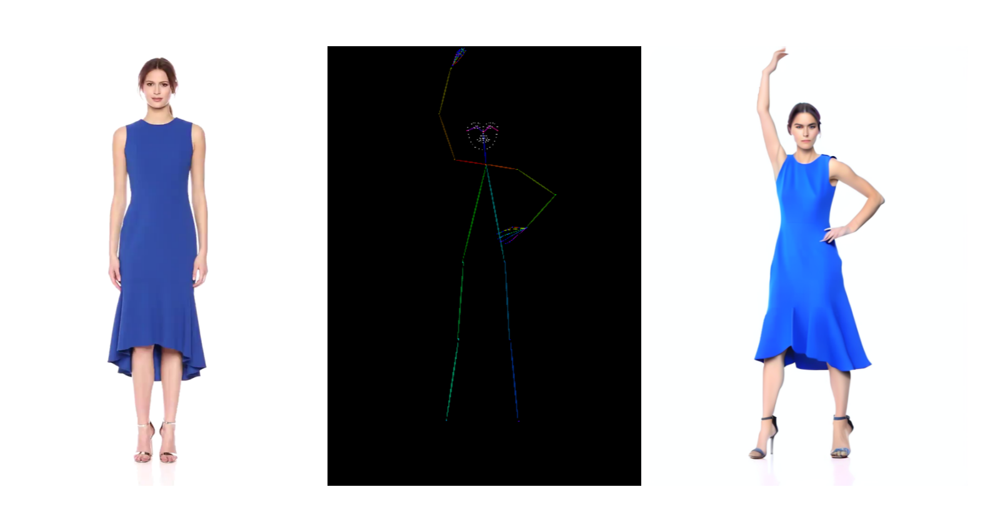

# Pose2Image

  
   
  <i>This is the project for training the posenet to control the image on sd2-1. The experiments show that the posenet can control the pose, but the face and hands not well.</i>

